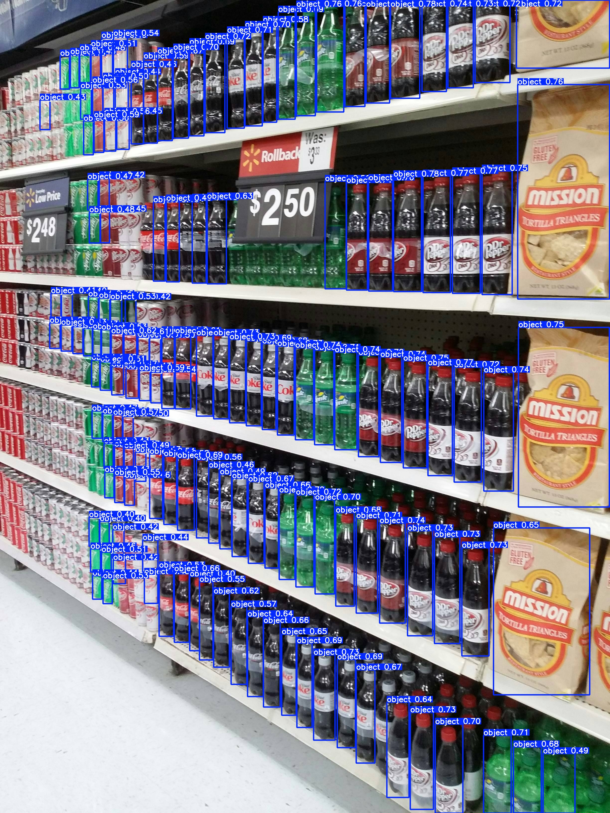
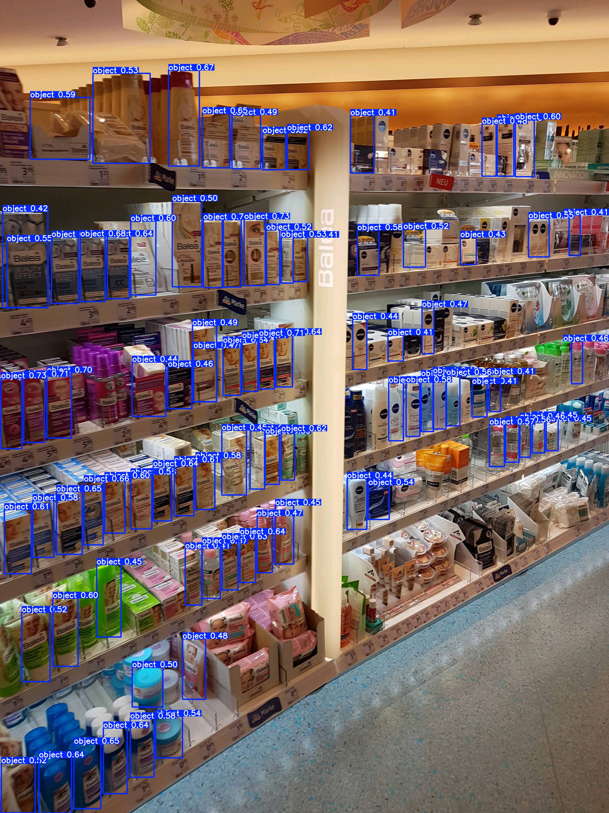

# Shelf Object Detection
This project focuses on detecting objects on store shelves using computer vision techniques. The goal is to enable automated analysis of shelf inventory, providing insights into product placement and availability. It involves data preprocessing, model training, and predictions using pre-trained weights for object detection on images.
<p align="center">
    
    
    
</p>

# Features
- __Training__
    - __Dataset Subsampling:__ Dynamically subsample the dataset to a specified number of training, validation, and test samples, enabling flexible experimentation with different dataset sizes.
    - __Image Preprocessing:__ Automatically preprocess images to adapt to the input size requirements of the model. This includes resizing, cropping, and any other necessary transformations.
    - __Label Adjustment:__ Adjust and normalize labels to align with the resizing factors applied during image preprocessing, ensuring accurate training.
- __Predition__
    - __Loading Custom Pre-trained Weights:__ Easily load custom weights to fine-tune the model or make predictions on new datasets, leveraging transfer learning techniques.
    - __Input Flexibility:__ Accept specified input images for prediction, allowing for testing on various datasets without additional configuration.

# Technologies Used
This project utilizes a range of tools and libraries to facilitate the development process:

- __Python:__ The primary programming language for the implementation.
- __OpenCV:__ Used for image processing tasks such as resizing, augmentation, and visualization.
- __Matplotlib:__ A plotting library for visualizing training progress and model predictions.
- __Jupyter Notebook:__ Provides an interactive environment for prototyping and experimentation.
- __Google Colab:__ Offers cloud-based GPU acceleration for faster model training.
- __Click:__ A Python package for creating command-line interfaces, enabling easy-to-use CLI commands for training and predictions.

# Installation
Follow these steps to set up the project environment:

1. __Clone this repository:__
    ```bash
    git colone https://github.com/randyjhc/store-shelves-detector.git
    ```
    This will download the project files to your local machine.


2. __Install dependencies:__
    - Install the required Python packages listed in `requirements.txt` using `pip`:
        ```
        pip install -r requirements.txt
        ```
    - Alternatively, you can leverage the Makefile to install dependencies:
        ```
        make install
        ```
    This step ensures that all necessary libraries are available for the project.


# Usage
This project includes a command-line interface (CLI) for ease of use. Below are examples of how to perform different tasks.

- __Training the model__
    The CLI command allows you to train the model with various parameters:

    1. __Specify the number of samples__ for training, validation, and testing:
        ```
        --samples (40, 10, 10)
        ```
        This argument sets the number of images for each dataset split.

    2. __Resume training__ from a custom weights file:
        ```
        --weights last.pt
        ```
        This option is useful for continuing training from the last saved checkpoint.

    3. __Define the number of training epochs__ 
        ```
        --epochs 10
        ```
        Specifies the number of times the entire dataset will pass through the training process.

    4. __Combining the options together:__
        ```
        python shelves_detect.py train --samples (X,Y,Z) --weights WEIGHT_PATH --epochs N
        ```
        Replace `X`, `Y`, `Z`, `WEIGHT_PATH`, and `N` with your desired values to start training.

- __Prediction__
The prediction functionality allows you to perform object detection on images using a pre-trained model. There are two key arguments you need to specify:

    1. __Specify the Pre-trained Model:__ Provide the path to the pre-trained model weights. This file contains the model's parameters that have been fine-tuned for object detection on a specific dataset.

    2. __Assign a List of Image for Prediction:__ Specify paths to the image on which you want to perform object detection in a text file. This image will be processed by the model to detect objects and generate predictions. See example content of the file [HERE](./samples/input_list.txt).

    __Combining 1. and 2.__
    To execute the prediction, use the following command:
    ```
    python shelves_detect.py predict MODEL_PATH IMAGE_LIST
    ```
    Replace `MODEL_PATH` with the path to your model weights file and `IMAGE_LIST` with the path to the image you wish to analyze. This will initiate the object detection process, and the results will be displayed or saved based on the script’s configuration.
    
# Project Structure
The project follows a structured organization to maintain clarity and support efficient development.

## Default Structure
Upon cloning the repository, the following files and directories will be present:
```
├── shelves.ipynb       # Jupyter notebook for interactive experimentation
├── train.yaml          # Configuration file for training parameters
├── shelves_detect.py   # Main script for training and prediction
├── README.md           # Project documentation
├── samples             # Folder containing example input and output images
    ├── inputs          # Sample input images
    ├── outputs         # Resulting predictions and visualizations
```

## Structure After Training
The following folders will be generated after running the training script:
```
├── 01_datasets         # Subsampled dataset for training, validation, and testing
    ├── images          # Images categorized into training, validation, and testing sets
        ├── test
        ├── train
        ├── val
    ├── labels          # Corresponding label files for each image
        ├── test
        ├── train
        ├── val
├── 02_preprocess       # Preprocessed datasets for model input
    ├── images          # Preprocessed images
        ├── test
        ├── train
        ├── val
    ├── labels          # Preprocessed labels
        ├── test
        ├── train
        ├── val
```
# Model Architecture
For shelf object detection, this project uses the YOLO v11 model, specifically the `yolo11n` variant, chosen for its lightweight nature and efficiency in real-time detection tasks. The yolo11n model contains approximately 2.5 million trainable parameters, making it suitable for deployment on resource-constrained environments without compromising detection accuracy.

The YOLO v11 architecture consists of three main components:

1. __Backbone:__ Responsible for extracting essential features from the input image using convolutional layers. It forms the foundation of the model by identifying various visual patterns across different scales.

2. __Neck:__ Acts as a bridge between the backbone and the head, further refining the extracted features. It improves the model's ability to detect objects of different sizes by aggregating multi-scale feature maps.

3. __Head:__ Performs the final predictions, generating bounding boxes and class probabilities for the detected objects. The head outputs the detection results for each object in the image.

For more details, refer to the official YOLO v11 documentation: [Ultralytics YOLO v11](https://docs.ultralytics.com/models/yolo11/).

# Dataset
To fine-tune the model for shelf object detection, the SKU110K dataset is utilized. This dataset, introduced at CVPR 2019, contains images of store shelves with various products, making it well-suited for training models aimed at detecting objects in retail environments.

In this project, the dataset is downloaded through kagglehub API. The dataset link can be found [Here](https://www.kaggle.com/datasets/thedatasith/sku110k-annotations)

You can also find more information about the SKU110K dataset and download it here: [SKU110K Dataset on GitHub](https://github.com/eg4000/SKU110K_CVPR19).

# Training
Training was conducted in a cloud-based environment using Google Colab, which provides access to a T4 GPU with 16 GB of RAM. The training process took approximately 10 minutes per epoch for the entire dataset. The current sample output images was predicted by a nine-epoch trained model.

# Results
The prediction results obtained from the trained model are displayed below. The output demonstrates the model's ability to detect and localize objects on the shelf with bounding boxes and class labels.

<p align="center">
    
    
    
</p>

For more samples, please feel free to take a look [Here](./samples/outputs/).

# Reference
[1] Jocher, Glenn, and Jing Qiu. Ultralytics YOLO11. 11.0.0, 2024, https://github.com/ultralytics/ultralytics.

[2] Goldman, Eran, et al. ‘Precise Detection in Densely Packed Scenes’. Proc. Conf. Comput. Vision Pattern Recognition (CVPR), 2019.
